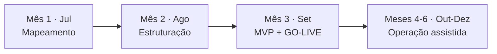
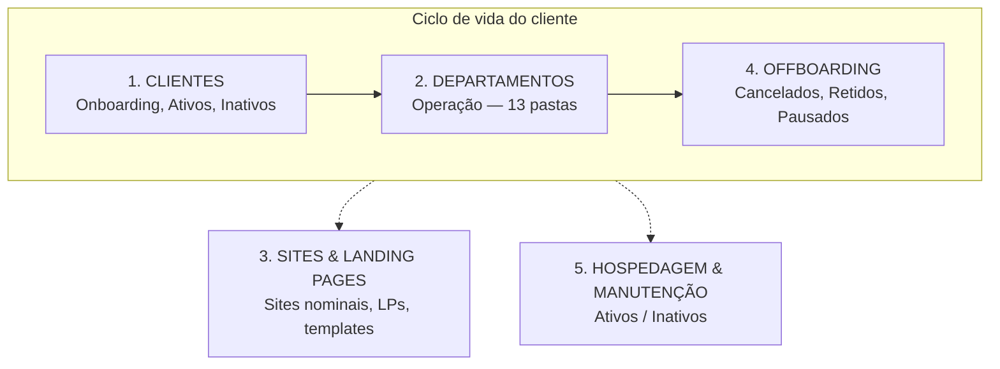

# Projeto Fibbo — Base de Conhecimento

> **Documento vivo.** README central do engajamento entre **Paolla Fonseca Consultoria** e a **Fibbo**. Consolida contrato, escopo, cronograma, diagnóstico do ClickUp e decisões de estrutura. Atualizar a cada marco.

---

## Regras de governança do engajamento

> **REGRA CRÍTICA — alterações no ClickUp**
> A Paolla Fonseca Consultoria é um agente **externo**. **Nenhuma** alteração no ClickUp da Fibbo (criar, editar, mover, arquivar ou excluir tarefas, listas, pastas ou campos) pode ser feita sem **aprovação explícita e prévia** do cliente. Leitura e varredura diagnóstica são permitidas; qualquer escrita exige confirmação caso a caso.

---

## 1. Contexto do projeto

| Item | Descrição |
|---|---|
| **Cliente** | Fibbo (agência de marketing) |
| **Consultoria** | Paolla Fonseca Consultoria — PM e consultoria operacional |
| **Contrato** | Ref. `PFC-2026-001` |
| **Sponsor / decisor** | Fabrício (CEO da Fibbo) |
| **Vigência** | 6 meses, início **02/07** |
| **Go-live alvo** | Fim de setembro (Mês 3) |
| **Operação assistida** | Out–dez (Meses 4–6) |
| **Fase atual** | Fase 1 — Mapeamento e Planejamento |
| **Plataforma operacional** | ClickUp (núcleo da operação da Fibbo) |
| **Cliente de referência no diagnóstico** | Contrato Fibbo × 21VINTE7 (insumo da Cláusula 6.1c) |

### 1.1 Objetivo do projeto

Devolver **visibilidade gerencial** à operação da Fibbo e transformar o **ClickUp em fonte única e confiável** de toda a operação.

### 1.2 Fora de escopo

- Integrações com IA / N8N
- Execução das entregas-fim dos clientes
- Desenvolvimento de software
- Revisão do modelo de gestão proprietário
- Migração massiva de dados sem levantamento prévio

---

## 2. Cronograma macro — 6 meses, 3 fases, 1 go-live

| Mês | Fase | Entregável associado |
|---|---|---|
| 1 (jul) | Mapeamento e planejamento | Relatório de diagnóstico + plano de ação priorizado |
| 2 (ago) | Estruturação: processos, padrões, templates, automações | Workspace reestruturado + documentação |
| 3 (set) | MVP em operação, treinamentos, **go-live** | Modelo de esforço/capacidade, time treinado, playbook, indicadores de adoção |
| 4–6 (out–dez) | Operação assistida | Ajustes finos + reforço de adoção |

### 2.1 Cronograma da Fase 1 (semana a semana)

| Semana | Período | Foco | Entregável parcial |
|---|---|---|---|
| S1 | 07–11/jul | Kickoff + coleta de insumos documentais | Acordos formalizados em ata |
| S2 | 14–18/jul | Entrevistas + auditoria do ClickUp | Roteiros aplicados, notas consolidadas |
| S3 | 21–25/jul | Análise e estruturação do diagnóstico | Rascunho do relatório |
| S4 | 28–31/jul | Validação com Fabrício + plano de ação | Relatório final + plano aprovado |

### 2.2 Entregas do Mês 1

1. **Relatório de diagnóstico** — situação atual da operação + situação atual do ClickUp + gaps
2. **Plano de ação priorizado** — o que será feito nos Meses 2 e 3, em que ordem e por quê
3. **Lista fechada de dashboards aprovados** — proteção contra scope creep

---

## 3. Cláusulas contratuais críticas

| Cláusula | Tema | Por que importa |
|---|---|---|
| **6** | Obrigações do cliente | Ponto focal designado, acesso admin ao ClickUp, escopo recorrente documentado. **6.2:** atraso do cliente = prorrogação sem ônus, **mas só com rastro documental**. Formalizar cobranças por escrito. |
| **10** | Rescisão e go-live | Go-live é o **marco financeiro mais importante**: antes dele, rescisão = 30% do saldo; depois, saldo integral. A definição do que constitui go-live precisa ser acordada por escrito. |
| **2.1.f** | Dashboards | "Todo e qualquer dashboard que fizer sentido" = escopo aberto. Fechar lista aprovada no diagnóstico; novo dashboard = aditivo. |
| **2.3** | Aprovação de processos novos | Precisa de ritual: quem apresenta, em que fórum, com que SLA (sugestão: 5 dias úteis). |
| **5.2.1** | Cadência | 2 reuniões semanais fixas com agendamento prévio (janela 7h30–10h30 ou pós-18h). |
| **16** | Comunicação | Canal oficial a definir (sugestão: e-mail para decisões, WhatsApp para operacional). |

---

## 4. Portfólio de produtos da Fibbo

A operação é uma **matriz produto × cliente** com cadências heterogêneas (contínuo, mensal, quinzenal, anual, inicial, sob demanda). Isso define diretamente a arquitetura do workspace no Mês 2.

**Frentes principais:**
- **Result Machine** — planejamento digital, performance, criativos de campanha, termômetro de marca, IA
- **FibboMetrics** — redes sociais/reputação, SEO/GEO, campanhas de mídia, identidade de marca
- Atualização mensal recorrente com entregáveis fixos
- Comissionamento variável acima de R$ 15k/mês de mídia

**~10 produtos distintos identificados:** FibboMetrics, Performance, Conteúdo, SEO, GEO, Site, Leads, Hospedagem, Academy, Chat.

> **Provocação registrada:** o ClickUp precisa orquestrar essa matriz por cliente simultaneamente. Quanto mais clientes ativos, mais rápido a complexidade cresce — pergunta a fechar antes da arquitetura: quantos clientes ativos hoje e quantas frentes cada um contrata.

---

## 5. Retrato do ambiente ClickUp (varredura)

Varredura estrutural completa via integração. **5 Spaces**, organizados por **ciclo de vida do cliente** cruzado com **operação por departamento**.

### 5.1 Mapa dos Spaces

### 5.2 Detalhe dos Spaces

| Space | Estrutura | Observação |
|---|---|---|
| **CLIENTES** | Onboarding → Clientes (Ativos/Inativos) → Templates | Funil de entrada + base cadastral. Lista "Clientes Ativos" acumula funções misturadas (ver §6). |
| **DEPARTAMENTOS** | 13 pastas: Email MKT, Redes Sociais, Performance/Dados, SEO, Relatórios, Sistemas/Automações, Suporte, Brandformance, IA, **Operação Fibbo**, Design, Atendimento | Space mais denso; produção real acontece aqui. Contém redundância estrutural. |
| **SITES & LANDING PAGES** | Criação de Site (clientes nominais), LPs, Suporte, 2 pastas de templates | Únicos clientes com lista nominal própria: Lecard, 3Medica, PBA Stones, CentroRochas. Templates duplicados. |
| **OFFBOARDING** | Em Processo → Encerrados (Cancelados/Retidos/Pausados) → Templates | Espelha CLIENTES na saída. Espinha coerente. |
| **HOSPEDAGEM & MANUTENÇÃO** | Ativo / Inativos | Simples e funcional. |

---

## 6. Diagnóstico — maduro vs. a corrigir

### 6.1 Ativos a preservar

**A camada de gestão de clientes via custom fields é o maior ativo do ambiente** — invisível na estrutura de pastas. ~30 campos padronizados no workspace:

- **Financeiro/comercial:** MRR, Budget de Mídia Mensal, Plano Contratado (Performance Digital / Máquina de Resultados / Brandformance / Custom)
- **Saúde da conta:** Health Score, Status do Cliente (Saudável / Atenção / Risco / Churn), Rating
- **Ciclo de vida:** Fase (Onboarding / Ativo / Pausa / Encerrado), Data de Assinatura, Início/Vencimento do Contrato, Dias até Vencimento (fórmula), Data Fim Onboarding
- **Operacional:** papéis nominais (Gestor de Tráfego, CS Manager, Gerente de Projetos, Designer Principal, Copywriter, Social Media, Analista de Dados, Head Inteligência), % Materiais Recebidos, % Acessos Recebidos, Próximo Check-in, Última Interação
- **Segmento:** E-commerce, SaaS, Serviços, Indústria, Educação, Saúde, Varejo, Outros
- **Ligados a riscos de Fase 1:** **Data de Go-Live** e **Dashboard Analytics** já existem como campos — provavelmente sem definição formal por trás.

> A Fibbo já tem a espinha de dados para dashboards de portfólio. O problema não é falta de dados — é **onde eles vivem** e a **falta de separação** entre cadastro e execução.

Preservar também: o **desenho do ciclo de vida** (CLIENTES → DEPARTAMENTOS → OFFBOARDING) é coerente.

### 6.2 Inconsistências a tratar

| # | Achado | Evidência | Impacto |
|---|---|---|---|
| 1 | **"Operação Fibbo" é estrutura fantasma** | As 7 listas da pasta têm **0 tarefas**. A produção real segue nas pastas departamentais (ex.: "Produção Email MKT" com 37 tarefas). | Duas estruturas concorrentes. Impede medir capacidade. |
| 2 | **Lista "Clientes Ativos" acumula 3 funções** | Registros-mestre + tarefas operacionais avulsas + faturamento recorrente na mesma lista. | Suja relatórios; foco de retrabalho. |
| 3 | **A própria Fibbo é tratada como cliente** | "Fibbo" e "FATURAMENTO FIBBO" como tarefas em Clientes Ativos; pasta "Operação Fibbo" em DEPARTAMENTOS. | Fronteira interno-vs-cliente borrada. Contamina métricas. |
| 4 | **CEO como assignee de tarefas operacionais** | Fabrício responsável por registros de clientes (CBL, Brix, Fibbo). | Cadastro incompleto ou dependência operacional do sponsor. |
| 5 | **Templates duplicados sem governança** | Pasta "arquivo" (SITES) com 8 templates repetindo "[TEMPLATES] NÃO MEXER". | Padronização não consolidada. Alavanca para o go-live. |

---

## 7. Riscos e dependências

| Risco / Dependência | Situação | Ligação com a varredura |
|---|---|---|
| **Definição de go-live** | Ambígua; peso contratual/financeiro (Cláusula 10). Levar proposta **redigida**, não construir ao vivo. | Campo "Data de Go-Live" existe; falta critério formal. |
| **Escopo de dashboard** | Aberto (2.1.f); risco de scope creep. | Dados existem, presos em estrutura por departamento. Campo "Dashboard Analytics" existe. Limpar base **antes** de construir. |
| **Cláusula 6** | Pendente: ponto focal, acesso admin, escopo recorrente. | Acesso admin é dependência para continuar a auditoria. |
| **Ritual de aprovação do CEO** | A estabelecer (2.3). | Reforçado pelo achado #4. |
| **Matriz produto × cliente** | Complexidade não transparente no contrato. | ~10 produtos com cadências distintas. Impacta arquitetura do Mês 2. |

---

## 8. Kickoff — os 7 acordos a fechar em ata

1. **Ponto focal** — nome + horas/semana dedicadas
2. **Reuniões fixas** — dia e horário das 2 semanais (janela 7h30–10h30 ou pós-18h)
3. **Canal oficial** — onde decisões valem (e-mail decisões / WhatsApp operacional)
4. **Prazo de acessos** — data para acesso admin ClickUp + escopo recorrente (destrava Cláusula 6.2)
5. **Definição de go-live** — proposta redigida para o Fabrício ajustar e fechar
6. **Ritual de aprovação do CEO** — fórum + SLA (sugestão 5 dias úteis)
7. **Critério de aceite dos entregáveis** — quem valida e em quanto tempo

> **Alerta estratégico:** o item 5 é negociado com quem tem interesse oposto — quanto mais exigente o go-live, mais tarde o Fabrício "deve" o saldo integral. Levar proposta pronta; construir ao vivo tende a subir a régua.

---

## 9. Decisões pendentes — quem bate o martelo

### Decisão do Fabrício (CEO / sponsor)
- **Estrutura operacional única:** migrar para "Operação Fibbo" e arquivar as antigas, **ou** matá-la e manter as departamentais. Não dá para manter as duas.
- **Regra interno-vs-cliente:** como a operação interna da Fibbo é rastreada separadamente.
- **Definição formal de go-live.**
- **Escopo do dashboard** (guardrail contra scope creep).

### Execução da consultoria (Paolla) — mediante aprovação
- Limpeza da lista "Clientes Ativos" (separar cadastro de execução)
- Governança de templates (consolidar, eliminar duplicados)
- Desenho dos rituais de aprovação
- Metodologia de diagnóstico (net new — construída do zero)

---

## 10. Identidade visual

**Fibbo (cliente):** fundo `#F2F2F0`, texto `#1A2332`, destaque laranja `#E8450A`, secundário teal `#2D6B6B`, cards brancos com cantos arredondados. Sans-serif bold para títulos, labels em caps espaçadas. Clean, muito espaço em branco.

**Paolla Fonseca Consultoria:** preto + branco puro (minimal). **Pendente:** logo (PNG fundo transparente) e paleta definitiva.

---

## 11. Próximos passos (Fase 1)

- [ ] Formalizar obrigações da Cláusula 6 (ponto focal, acesso admin, escopo recorrente)
- [ ] Cravar as 2 reuniões semanais fixas na agenda
- [ ] Redigir proposta de definição de go-live (levar pronta ao kickoff)
- [ ] Fechar lista de dashboards aprovados
- [ ] Aprofundar auditoria: qualidade do cadastro, preenchimento de Go-Live e Dashboard Analytics, volume por pasta departamental
- [ ] Levantar nº de clientes ativos e frentes contratadas por cliente
- [ ] Completar mapeamento de insumos da Fase 1
- [ ] Consolidar metodologia de diagnóstico
- [ ] Fechar diagnóstico + plano de ação priorizado (fim de julho)

### Insumos pendentes da Paolla
- [ ] Logo da Paolla Fonseca Consultoria
- [ ] Paleta de cores / identidade visual definitiva
- [ ] **Gravação/transcrição da reunião com o cliente** (se existir — ainda não recebida)

---

## 12. Histórico de atualizações

| Data | Atualização |
|---|---|
| 08/07 | Criação do README. Varredura estrutural completa do ClickUp (5 spaces, ~30 custom fields, 5 inconsistências). Integração do histórico do chat de planejamento: contrato, escopo, cronograma, cláusulas, 7 acordos do kickoff e portfólio de produtos. |

---

*Base viva do projeto. Toda alteração no ClickUp exige aprovação prévia do cliente.*
