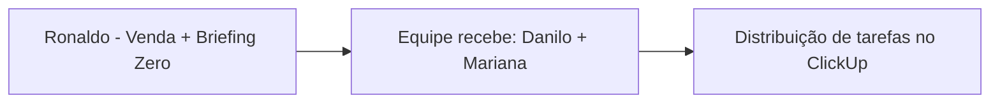

# Ata – Reunião de Mapeamento (13/07/2026)

**Contrato:** PFC-2026-001 | **Fase:** Mapeamento (Mês 1)
**Participantes:** Paolla Fonseca (Consultoria), Fabrício Coimbra (CEO/Sponsor). Mariana Velten convidada, sem falas registradas nesta sessão.

## Objetivo
Alinhar o entendimento dos serviços vendidos (pacotes/combos), metodologia comercial e identificar o eixo de reestruturação do ClickUp.

## Mapeamento realizado

- **Metodologia Fibo/Fibometrics**: monitoramento de 7 canais (Social, Anúncios, Reputação, SEO, Google, Site, Landing Page) via painel Fibometrics. Meta de evoluir de relatório estático para portal do cliente em tempo real (comparação de desempenho, concorrência, OKRs).
- **Dois caminhos de contratação**: Caminho 1 (inteligência/recomendação) x Caminho 2 (execução completa pela Fibbo). Contratos são flexíveis a partir desse eixo.
- **Regra padrão de mídia paga**: investimento acima de R$ 15.000 gera taxa de 10% a 20%.
- **Gestão de saúde do cliente**: NPS coletado ao fim das reuniões, mas ainda não integrado a dados operacionais para sinalizar clientes "em amarelo".
- **Fluxo de onboarding (AS IS)**:

- **Fibo OS**: sistema interno com manuais, fluxos de entrega, definição de cargos e 3 camadas de acesso (Administrativo, Equipe, Cliente), com uso de agentes de IA.
- **Diagnóstico central**: ClickUp está estruturado por setor operacional, não por cliente — isso fragmenta a visão de ciclo de vida do cliente. Ticket médio de R$ 8.000 é considerado alto frente à experiência de proximidade entregue.

## Decisão registrada
Reestruturar o ClickUp com eixo central no **cliente** (não no departamento), mantendo por ora a estrutura existente (sem migração de espaço). Fabrício validou o insight como ponto fundamental da consultoria.

## Pendências de gestão identificadas
- 1‑on‑1 mensal delegado por Fabrício a Mariana não está funcionando — falta retorno de informação a Fabrício.
- Playbook de onboarding existe, mas Danilo não vinha seguindo as diretrizes anteriormente.

## Próximas etapas

| Responsável | Ação | Prazo |
|---|---|---|
| Paolla Fonseca | Definir controle de extras (criativos fora do escopo) no ClickUp | A combinar |
| Paolla Fonseca | Validar com Mariana o fluxo de cruzamento de tarefas entre mídia paga e social | A combinar |
| Fabrício Coimbra | Criar pasta no Drive para centralizar documentos da consultoria | A combinar |
| Paolla Fonseca | Subir ao Drive os documentos recebidos via chat | A combinar |
| Fabrício Coimbra | Enviar playbook de onboarding (mapeamento 90 dias) | A combinar |
| Fabrício Coimbra | Conceder acessos a RH/CRM e enviar arquivos em Markdown | A combinar |
| Fabrício Coimbra | Incluir Paolla nos chats da equipe | A combinar |
| Paolla Fonseca | Estruturar proposta de reorganização do ClickUp por cliente | Até semana seguinte (fim de semana/início da próxima) |
| Paolla Fonseca | Reunião operacional com Mariana (rotina de trabalho, sem avaliar desempenho pessoal) | Dia seguinte (14/07) |

## Acordo de agenda
Reuniões futuras com Fabrício ajustadas para 9:20–9:30 (rotina de creche do filho).

---
*Ata consolidada por Paolla Fonseca Consultoria a partir das anotações automáticas da reunião. Repositório do projeto: https://github.com/paolla-consultoria/consultoriafibbo*
