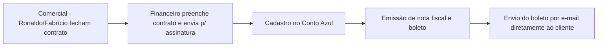

# Ata – Reunião de Mapeamento (14/07/2026)

**Contrato:** PFC-2026-001 | **Fase:** Mapeamento (Mês 1)
**Participantes:** Paolla Fonseca (Consultoria), Financeiro Fibbo. Mariana Velten e Fabrício citados, sem falas diretas registradas.

## Objetivo
Mapear o fluxo financeiro e operacional (fechamento de contrato, cobrança, relatórios) e definir o plano de ação para estruturação das tarefas padrão de entrega.

## Mapeamento realizado

- **Ferramentas financeiras**: Conto Azul (emissão de notas/boletos) + planilha manual espelhada — Fabrício decide com base na planilha, não no sistema.
- **Fluxo de fechamento de contrato**:

- **Dados cadastrais**: Ronaldo fornece CNPJ, razão social e contato financeiro — oportunidade de unificar em ponto único para evitar retrabalho.
- **Cobrança**: recorrente mensal, inadimplência rara; controle serve principalmente para baixa no fluxo de caixa.
- **Budget de mídia**: time de performance (Felipe/Guilherme) gera os boletos; Financeiro apenas encaminha ao cliente, sem lançar no sistema financeiro.
- **Relatórios gerenciais**: semanais (contas a pagar/receber) e mensais (indicadores + orientação) para Fabrício.
- **ClickUp no financeiro**: não é usado, exceto um controle básico de faturamento para uso próprio.
- **Decisão registrada**: não migrar o acompanhamento financeiro operacional para o ClickUp — mantém-se Conto Azul + planilha, com exceção do status "cliente ativo".
- **Atendimento administrativo**: via "Fibo Chat" (espelha WhatsApp sem expor número pessoal), acionado quando Danilo está indisponível.
- **Gargalo identificado**: time de performance (Mateus/Guilherme) não é full-time e não usa o ClickUp com frequência suficiente para acompanhamento.
- **Gestão granular**: entregas grandes (ex.: site em 40 dias) devem ser quebradas em subtarefas para monitoramento real do progresso.
- **Design**: dividido em 3 subgrupos (redes sociais, criativo de campanha, sites); avalia-se apoio de estagiário júnior.
- **Aprovações**: redes sociais/e-mail/blog aprovadas no grupo do cliente; sites com aprovação tácita contratual após 3 dias sem resposta.
- **SLA vigente**: 3 dias (simples) / 5 dias (médio) / 7 dias (complexo).
- **Centralização de demandas**: planilha intermediária antes da entrada no ClickUp (feita por Mariana) — criada para resolver perda de controle de demandas via WhatsApp.

## Plano de ação definido para Mariana Velten
1. Mapear todas as tarefas padrão por entrega (site, landing page etc.), sem responsáveis/tempo nesta etapa.
2. Aplicar IA sobre o histórico de WhatsApp e chats de atendimento dos últimos 3 meses, gerando relatório de demandas.
3. Estudar o conceito de WBS para decompor esforços e vincular cada tarefa a uma entrega contratada.

## Próximas etapas

| Responsável | Ação | Prazo |
|---|---|---|
| Financeiro Fibbo | Enviar questionário financeiro preenchido (PDF) | A combinar |
| Financeiro Fibbo | Criar modelo de comunicado de encerramento de contrato | A combinar |
| Financeiro Fibbo | Organizar tarefas de suporte/aprovação de artes no ClickUp | A combinar |
| Mariana Velten | Mapear tarefas padrão por entrega contratada | Próxima semana |
| Mariana Velten / Fabrício | Rodar IA sobre histórico de WhatsApp/atendimento (3 meses) | A combinar |
| Mariana Velten | Estudar WBS | A combinar |
| Paolla Fonseca | Redigir prompts de IA para análise do histórico de atendimento | A combinar |
| Paolla Fonseca | Alinhar com equipes operacionais os processos de trabalho e gestão de tarefas | A combinar |

## Riscos / pontos de atenção
- Dependência de planilha intermediária manual antes do ClickUp (risco de erro/perda de dado).
- Falta de padronização no uso do ClickUp por performance e design, herdada da adoção adaptativa pós-abandono de consultoria anterior.
- Time de performance como gargalo por baixo engajamento com a ferramenta.

---
*Ata consolidada por Paolla Fonseca Consultoria a partir das anotações automáticas da reunião. Repositório do projeto: https://github.com/paolla-consultoria/consultoriafibbo*
