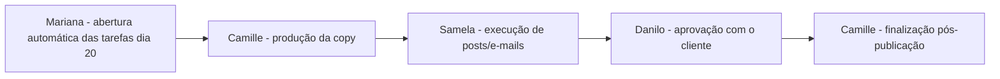

# Ata – Reunião de Mapeamento (16/07/2026)

**Contrato:** PFC-2026-001 | **Fase:** Mapeamento (Mês 1)
**Participantes:** Paolla Fonseca (Consultoria), Fabrício Coimbra, Mariana Velten, Samela Araujo, Camille Ferrugine, Raquel Fibbo, Lais Fibbo.

## Objetivo
Mapear os processos do time de conteúdo e sites, identificar dores no uso do ClickUp e validar a mudança de estrutura organizacional.

## Mapeamento realizado

- **Fluxo de conteúdo (linha editorial e e-mail)**:

Capacidade: 8 a 13 posts por linha editorial (5–6h de execução); e-mails permitem ~4 unidades por vez.

- **Fluxo de sites (Raquel)**: escopo → pesquisa de referência → geração de imagens → implementação da cópia (após materiais do cliente) → ajuste com desenvolvimento (Lucas) para contraste/UX. Ciclo de ~1 a 1,5 semana até aprovação final do cliente.
- **Dependência crítica**: criativo de campanha (Laí) depende do recebimento de materiais do cliente (fotos, listas de cursos) — gargalo recorrente quando o envio atrasa.
- **Problemas técnicos no ClickUp**: chat não atualiza em tempo real e histórico de mensagens se perde/mistura, exigindo atualização manual da página. Uso de threads é uma mitigação parcial, sem garantia técnica de tempo real.
- **Falha em automações**: subtarefas e responsáveis perdem prazo ao serem desdobrados mensalmente; tarefas principais ficam abertas para refletir progresso, subtarefas são fechadas individualmente e precisam ser reabertas manualmente em caso de ajuste.
- **Uso fragmentado**: Camille usa o ClickUp apenas para visualizar demandas, recorrendo a Notion e post-its para organização pessoal — ferramenta percebida como complexa sem treinamento dirigido.
- **Comunicação**: grupos do ClickUp com baixa interação; equipe prioriza WhatsApp para conversas rápidas, apesar de o ClickUp ser o canal oficial de formalização.

## Decisão estratégica confirmada
Migrar a estrutura de departamento para **cliente/projeto**, motivada pelo NPS: execução técnica é elogiada, mas falta comunicação e acompanhamento ao cliente.

- **"Área do Cliente"**: espelho no ClickUp mostrando status e permitindo aprovações, sem acesso a arquivos de trabalho (Figma, pastas internas) — evita microgerenciamento.
- **Alerta de risco**: experiências anteriores com acesso direto do cliente a ferramentas de design geraram atrito e fiscalização. A nova estrutura deve restringir esse contato, mantendo o cliente na visão de ciclo de vida e aprovações.
- **Planejamento semanal**: proposto para substituir o mensal, permitindo identificar bloqueios antes do fechamento do mês.

## Riscos / pontos de atenção
- Gap recorrente entre planejado e executado.
- Adoção adaptativa do ClickUp após abandono de consultoria anterior gerou falta de padronização entre performance e design.
- Time de performance, embora tecnicamente forte, não engaja com o ClickUp — risco de continuidade do negócio por dependência de memória individual dos especialistas. **Este ponto reforça o achado já registrado no diagnóstico AS IS sobre Fabrício como bottleneck estrutural.**
- Sugestão de contratar perfil júnior para performance, espelhando a estrutura já usada em desenvolvimento.

## Próximas etapas

| Responsável | Ação | Prazo |
|---|---|---|
| Paolla Fonseca | Capacitação ClickUp: sessões sobre funcionalidades da ferramenta | A combinar |
| Paolla Fonseca, Fabrício, Mariana | Definir nova estrutura de pastas/projetos por cliente | A combinar |
| Paolla Fonseca | Desenvolver proposta TO-BE (estrutura + ritos semanais) | Próxima semana |
| Mariana Velten | Enviar template de tarefas atual (base de prototipagem) | A combinar |
| Mariana Velten | Reagendar reunião com performance e automação para hoje, 16:30 (realocando de segunda) | Hoje |
| Mariana Velten | Agendar reunião com Danilo | Próxima terça-feira |

## Ajuste de agenda
Conversa sobre sistemas transferida para hoje (terça), liberando a agenda de segunda-feira. Reuniões de hoje: 16:30 (performance) e 17:30 (automações, com Lucas no lado de desenvolvimento).

---
*Ata consolidada por Paolla Fonseca Consultoria a partir das anotações automáticas da reunião. Repositório do projeto: https://github.com/paolla-consultoria/consultoriafibbo*
