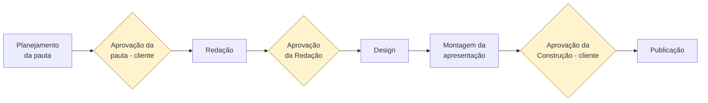
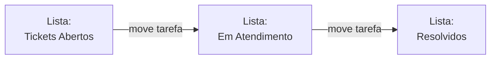
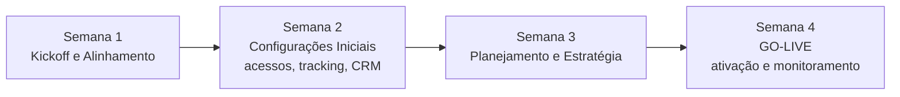
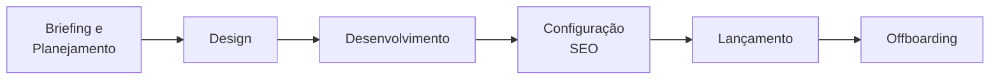

# AS IS — Estrutura, Processos e Operação do ClickUp Fibbo

**Projeto:** Consultoria Fibbo — Fase 1 (Mapeamento e Planejamento)
**Data da varredura:** 08/07/2026 (estrutura + tarefas via MCP) · 09/07/2026 (views, automações e stack técnica via API REST)
**Método:** Varredura somente leitura — MCP ClickUp (hierarquia completa, campos customizados, membros e amostragem de ~290 tarefas nos 3 spaces mais ativos) + API REST ClickUp v2 (views em todos os níveis, stack técnica inferida via listas de sistemas). Nenhum item foi alterado.

---

## 1. Sumário Executivo

O workspace da Fibbo possui **5 spaces, ~20 folders e ~60 listas**, montados sobre **três lógicas de organização concorrentes**: por cliente (CLIENTES), por função (DEPARTAMENTOS) e por tipo de entrega (SITES & LANDING PAGES). A operação real acontece quase toda em DEPARTAMENTOS — em especial na lista *Linha Editorial* — enquanto o space CLIENTES funciona como um registro contratual disfarçado de tarefas, majoritariamente atribuídas ao CEO e sem datas.

O resultado: **não existe hoje uma visão consolidada por cliente**, os statuses são inconsistentes entre listas, existem dois sistemas paralelos de tickets e a governança de templates está fragmentada. A estrutura tem bons fundamentos (campos customizados ricos, templates de onboarding e produção bem detalhados), mas eles estão desconectados da operação diária.

---

## 2. Estrutura Organizacional (Hierarquia)

```mermaid
graph TD
    W[Workspace Fibbo] --> S1[CLIENTES]
    W --> S2[DEPARTAMENTOS]
    W --> S3[SITES & LANDING PAGES]
    W --> S4[OFFBOARDING]
    W --> S5[HOSPEDAGEM E MANUTENÇÃO]

    S1 --> F11[Onboarding<br/>1 lista]
    S1 --> F12[Clientes<br/>Ativos / Inativos]
    S1 --> F13[Templates<br/>Onboarding / Ativo]

    S2 --> F21[Email Marketing · 3 listas]
    S2 --> F22[Redes Sociais · 2 listas]
    S2 --> F23[Performance e Dados · 6 listas]
    S2 --> F24[SEO · 3 listas]
    S2 --> F25[Relatórios · 3 listas]
    S2 --> F26[Sistemas e Automações · 5 listas]
    S2 --> F27[Suporte · 2 listas]
    S2 --> F28[Brandformance · 5 listas]
    S2 --> F29[Inteligência Artificial · 5 listas]
    S2 --> F2A[⚠️ Operação Fibbo · 7 listas]
    S2 --> F2B[Design · 1 lista]
    S2 --> F2C[Atendimento · 3 listas]

    S3 --> L31[⚠️ Ajustes site - Fibbo<br/>lista solta no root]
    S3 --> F31[Criação de Site · 4 projetos]
    S3 --> F32[Criação de Landing Pages · 3 listas]
    S3 --> F33[Suporte e Atendimento<br/>Abertos / Em Atendimento / Resolvidos]
    S3 --> F34[TEMPLATES NÃO MEXER · 1]
    S3 --> F35[arquivo · 8 templates]

    S4 --> F41[EM PROCESSO]
    S4 --> F42[ENCERRADOS<br/>Cancelados / Retidos / Pausados]
    S4 --> F43[TEMPLATES]

    S5 --> F51[Ativo]
    S5 --> F52[Inativos]
```

### 2.1 Observações estruturais

| # | Observação | Evidência |
|---|---|---|
| E1 | Três eixos de organização convivem: cliente, departamento e tipo de entrega | Spaces CLIENTES, DEPARTAMENTOS e SITES & LPs |
| E2 | Folder **"Operação Fibbo"** dentro de DEPARTAMENTOS replica os próprios departamentos como listas (Tráfego Pago, Social Media, SEO, Email Marketing, Relatórios, Sistemas, FibboMetrics) — estrutura dentro da estrutura | Folder 901514489066 |
| E3 | Lista solta no root de SITES & LPs ("Ajustes site - Fibbo") mistura trabalho interno com trabalho de cliente | Lista 901522005523, com tarefa ativa |
| E4 | Templates espalhados em 4 lugares: CLIENTES > Templates, [TEMPLATES] NÃO MEXER, folder "arquivo" (8 templates, com **2 versões duplicadas** de "Site Personalizado") e OFFBOARDING > [TEMPLATES] | Hierarquia |
| E5 | Suporte existe **duas vezes**: DEPARTAMENTOS > Suporte (Tickets de Suporte) e SITES & LPs > Suporte e Atendimento | Ambos com tarefas ativas na amostra |
| E6 | OFFBOARDING e HOSPEDAGEM são spaces inteiros para funções pequenas (2–4 listas cada) | Hierarquia |

---

## 3. Pessoas

14 membros no workspace. Papéis inferidos pela atividade amostrada:

| Pessoa | Atuação observada |
|---|---|
| Fabricio (CEO) | Assignee em massa das tarefas contratuais de CLIENTES; aprovações; tickets técnicos |
| Mariana Velten | Aprovações de redação/pauta; briefings de sites; check-ins semanais |
| Lucas Peçanha | Desenvolvimento, tickets técnicos, GTM, sites |
| Camilly Ferrugine | Produção da Linha Editorial (pauta, redação, publicação) |
| Samela Araujo / Laís Vieira | Design da Linha Editorial |
| Rackel Vasconcelos | Design de sites/LPs |
| Danilo Schellmann | Desenvolvimento e atendimento de sites |
| Phelipe Romano | Sistemas, automações, manutenção |
| Mateus Silveira | Automações |
| Jessica Reis, Guilherme Velten, Ronaldo Campos | Baixa atividade na amostra |
| Paolla Silva | Consultoria externa |

**Sinal relevante:** o CEO é o assignee padrão de dezenas de tarefas recorrentes — concentração que vira gargalo e distorce qualquer métrica de carga de trabalho.

---

## 4. Campos Customizados

~30 campos definidos **todos em nível de workspace** — herdados por todos os spaces, inclusive onde não se aplicam.

**Perfil dos campos:** quase todos orientados a **gestão de conta/contrato**, não a produção:

- **Contrato/financeiro:** MRR, Budget Mídia Mensal, Plano Contratado, Escopo do Contrato (URL), Início/Vencimento do Contrato, Dias até Vencimento (fórmula), Data de Assinatura
- **Ciclo de vida:** Fase (Onboarding/Ativo/Pausa/Encerrado), **Data de Go-Live**, Data Fim Onboarding, Materiais Recebidos (%), Acessos Recebidos (%)
- **Saúde da conta:** Status do Cliente (Saudável/Atenção/Risco/Churn), Health Score, Rating, Última Interação, Próximo Checkin
- **Papéis por cliente:** Gerente de Projetos, CS Manager, Gestor de Tráfego, Social Media, Copywriter, Designer Principal, Head Inteligência, Analista de Dados
- **Referências:** Pasta do Drive, Grupo WhatsApp, Dashboard Analytics, Segmento

**Diagnóstico:** o desenho dos campos é bom para um "CRM de clientes" dentro do ClickUp, mas nas tarefas de produção amostradas os campos não aparecem preenchidos e tags quase não são usadas. O metadado existe; a operação não o alimenta. Nota: **"Data de Go-Live" já existe como campo** — relevante para a definição formal de go-live do nosso contrato.

---

## 5. Processos e Fluxos de Operação Observados

### 5.1 Linha Editorial (o processo mais vivo do workspace)

Pipeline por cliente, rodando dentro de DEPARTAMENTOS > Redes Sociais > Linha Editorial. O cliente é identificado **apenas no nome da tarefa-mãe** (ex.: "Linha Editorial (Thalassa)").

8 etapas, 3 gates de aprovação (2 externos, 1 interno). Papéis consistentes: Camilly (conteúdo), Samela/Laís (design), Mariana (aprovação interna).

**Degradação observada:** os ciclos antigos tinham due dates em todas as etapas; os ciclos mais recentes rodam **sem nenhuma data**. Além disso, há lotes de tarefas com o mesmo timestamp de fechamento — indicando fechamento em massa retroativo, não fluxo real.

### 5.2 Tickets de Suporte (SITES & LPs)

**Antipadrão:** o status do ticket é representado **movendo a tarefa entre listas**, em vez de usar status. Na prática a amostra mostra tickets sendo concluídos dentro de "Tickets Abertos" sem nunca migrarem — ou seja, nem o antipadrão é seguido.

### 5.3 Onboarding de Cliente (template, 4 semanas)

Template detalhado (~35 tarefas), bem desenhado. A lista "Onboarding Ativo" existe mas não apareceu com atividade na amostra — **o template pode não estar sendo instanciado na prática**.

### 5.4 Criação de Site

Este fluxo **está rodando de verdade** (Lecard, 3Medica, PBA Stones, CentroRochas), uma lista por projeto, com etapas como tarefas.

### 5.5 Statuses em uso (inconsistência)

| Esquema observado | Onde |
|---|---|
| `to do` → `complete` | SITES & LPs, templates |
| `to do` → `completed` | Linha Editorial |
| `a iniciar` (PT) | CLIENTES > Clientes Ativos |
| `in progress` | Sites em produção |

Mistura de idiomas e de esquemas por lista. Qualquer dashboard consolidado quebra nessa base.

---

## 6. Achados Consolidados (dores para o TO BE)

| # | Achado | Impacto |
|---|---|---|
| A1 | **Três eixos de organização concorrentes** — uma mesma demanda pode viver em CLIENTES, DEPARTAMENTOS ou SITES & LPs | Ambiguidade de onde criar/achar trabalho; retrabalho |
| A2 | **Cliente é dimensão implícita na produção** (só no nome da tarefa) | Impossível visão consolidada por cliente — justamente o que os campos de CS prometem |
| A3 | **Statuses inconsistentes** entre listas (PT/EN, esquemas distintos) | Relatórios e dashboards não confiáveis |
| A4 | **CLIENTES > Clientes Ativos = registro contratual disfarçado de backlog**: dezenas de tarefas "a iniciar", sem data, quase todas no CEO | Gargalo no Fabrício; backlog morto; métrica de carga distorcida |
| A5 | **Campos customizados ricos porém não alimentados pela operação** | Metadado existe mas não gera informação |
| A6 | **Dois sistemas de tickets paralelos** | Cliente/equipe não sabe onde abrir; SLA impossível de medir |
| A7 | **Governança de templates fragmentada** (4 locais, duplicatas, pasta "arquivo") | Instanciação inconsistente; template de onboarding possivelmente não usado |
| A8 | **Listas usadas como status** (tickets) e **folder replicando departamentos** (Operação Fibbo) | Estrutura compensando ausência de processo |
| A9 | **Disciplina de datas em queda** e fechamentos retroativos em lote | Dados históricos não refletem a realidade; medição de lead time inviável |
| A10 | **"Data de Go-Live" existe como campo, sem processo visível associado** | Conecta diretamente ao risco contratual já mapeado no projeto |

---

## 7. Views e Dashboards

*Complemento via API REST do ClickUp — varredura de 09/07/2026. Cobre views em todos os níveis (workspace, space, folder, lista). Automações nativas do ClickUp não são expostas pela API pública.*

### 7.1 Dashboards

**Nenhum dashboard configurado no workspace.** O campo `dashboard` retornado pelo endpoint de views globais é `null`. Não há sequer um dashboard nativo do ClickUp em uso — toda visibilidade consolidada é feita via views de lista/quadro ou ferramentas externas.

### 7.2 Views por nível

| Nível | Localização | Views configuradas | Observação |
|---|---|---|---|
| Workspace | Global | Lista, Quadro, Calendário (obrigatórias) + Conversa "Fibbo" + Whiteboard "Fluxograma Atendimento Thalassa" + Doc "Meeting Notes" | Quadro global tem filtro de assignee travado em Jessica Reis — provável configuração pessoal que vazou como padrão |
| Space | DEPARTAMENTOS | Overview + Quadro | Único space com view adicional além do Overview padrão |
| Space | CLIENTES, SITES & LPs, OFFBOARDING, HOSPEDAGEM | Overview apenas | Sem views personalizadas |
| Lista | Linha Editorial | Board + Conversation | As duas principais views operacionais do processo mais vivo |
| Lista | Produção Email MKT | Conversation | |
| Lista | Criativos Ads | Conversation | |
| Lista | Produção de Conteúdo SEO | Conversation | |
| Lista | **Tickets de Suporte** | **Form (pública)** | "Formulário de Suporte" — único ponto de entrada estruturado para tickets; URL pública ativa |
| Lista | Lecard - Site / 3Medica - Site | Conversation | Usada para comunicação interna por projeto de site |

### 7.3 Whiteboard identificado

**"Fluxograma Atendimento Thalassa"** — clickboard criado por Phelipe Romano, visibilidade pública dentro do workspace. Único documento visual de processo encontrado; seu conteúdo não é exposto pela API, mas a existência indica que o fluxo de atendimento do Thalassa foi mapeado informalmente neste canvas.

### 7.4 Achados sobre views (diagnóstico)

| # | Achado | Impacto |
|---|---|---|
| V1 | **Zero dashboards** no workspace | Não existe visão gerencial consolidada — qualquer indicador é manual ou externo |
| V2 | **Quadro global filtrado acidentalmente** por uma pessoa (Jessica Reis) | Quem abre o board global do workspace só vê tarefas da Jessica; invisível para gestão |
| V3 | **Formulário de Suporte existe e está ativo** (Tickets de Suporte) | Há um canal estruturado, mas a operação mostra tickets sendo concluídos sem sair da lista "Abertos" — o form capta, a triagem não funciona |
| V4 | **Views concentradas num único processo** (Linha Editorial) | O processo mais maduro tem board + conversation; o restante da operação usa apenas list view padrão |
| V5 | **Fluxos de Automação (Email MKT) vazia** e **Check-ins Agendados vazia** | Estruturas criadas sem conteúdo — indicam intenção de processo sem execução |

---

## 8. Automações e Stack Técnica

*Automações nativas do ClickUp não são expostas pela API pública. O mapeamento abaixo é inferido a partir do conteúdo das listas do folder "Sistemas e Automações" e tarefas associadas.*

### 8.1 Automações nativas do ClickUp

Não há como listar programaticamente as automações nativas configuradas no workspace. A lista **"Automações"** (folder Sistemas e Automações) funciona como **backlog de desenvolvimento de automações externas**, não como registro das automações nativas. O conteúdo desta lista indica o que foi implementado ou está em fila:

| Status | Tarefa / Automação | Contexto |
|---|---|---|
| ✅ Concluído | Integrar Automações no Clickup | Sem descrição — automações externas direcionando dados para o ClickUp |
| ✅ Concluído | Direcionamento de formulários Lecard | Formulário de captação do cliente redirecionado via automação |
| ✅ Concluído | Automação - Saldo e envio de cobrança - Contas de Mídia Paga | Alerta/envio automático de saldo de contas de ads |
| ✅ Concluído | Plano Estratégico Thalassa | (Contexto de automação não especificado) |
| ✅ Concluído | Briefing Agente de Pré-atendimento do Thalassa | Fase de documentação do bot |
| 🔄 Em andamento | **Substituição do Stract nos Fluxos de Automação** | Crítico — ver §8.2 |
| 🔲 Backlog | Bot de Pré-atendimento Thalassa | Chatbot de pré-atendimento para o cliente Thalassa |

### 8.2 Crise de stack em andamento: substituição do Stract

**O Stract foi cancelado.** Phelipe Romano conduz ativamente a substituição:

> *"Adaptação necessária devido ao cancelamento do Stract. Será realizada a substituição das extrações por meio da API oficial da Meta e do Google."*

**Relatórios afetados:**
- Relatório de Saldo (mídia paga)
- Relatório de Contas — Google Ads
- Relatório de Contas — Meta Ads
- Relatório Redes Sociais

**Impacto para o TO BE:** os fluxos de relatório de performance estão em estado instável agora. Qualquer decisão sobre automação de relatórios no novo modelo precisa considerar que a stack de extração está sendo reescrita.

### 8.3 Stack de ferramentas identificada

| Ferramenta | Uso | Status |
|---|---|---|
| **Mautic** | Email marketing automation (LeCard) | Em implementação — "Configurações Técnicas" e "Implementação Mautic (LeCard)" concluídas |
| **Stract** | Extração de dados de mídia paga para relatórios | ❌ Cancelada — sendo substituída |
| **Meta API + Google Ads API** | Substituição do Stract para extração de dados | 🔄 Em desenvolvimento por Phelipe |
| **Chatwoot** | Plataforma de atendimento/chat (cliente CDS) | Ativo — manutenção registrada ("Manutenção Chatwoot (CDS)") |
| **Google Drive** | Repositório de arquivos (campo "Pasta do Drive" nos campos customizados) | Em uso — campo preenchido nos clientes |
| **WhatsApp** | Canal de comunicação com clientes (lista "Whatsapp" em Atendimento + campo "Grupo WhatsApp") | Em uso |

### 8.4 Achados adicionais (Sistemas)

| # | Achado | Impacto |
|---|---|---|
| S1 | **FibboMetrics existe como estrutura, mas está vazia** | Intenção de produto/métrica interna sem execução visível |
| S2 | **"Solicitar Acesso da API do Google Ads"** em backlog (Integrações) | Integração ainda não finalizada — relatórios de Google Ads dependem disso |
| S3 | **Lista "Fluxos de Automação" (Email MKT) completamente vazia** | O folder existe, mas nenhum fluxo está documentado ou rastreado ali |
| S4 | **Demandas Recorrentes** tem "Cronograma de Reunião Mensal" cadastrado **duas vezes** | Duplicata de tarefa recorrente — sinal de criação manual sem verificação |

---

## 9. Limitações da Varredura

A varredura original (MCP, 08/07/2026) não cobria: views, dashboards, automações nativas, permissões e docs internos. A complementação via API REST (09/07/2026) cobre views e stack técnica inferida. Permanecem **fora do escopo**:

- **Automações nativas do ClickUp** — não expostas pela API pública. Requerem sessão navegada na interface (Settings → Automations)
- **Permissões e papéis de acesso** — quem pode ver/editar o quê em cada space
- **Conteúdo dos docs** (Meeting Notes, whiteboard Thalassa) — metadado acessível, conteúdo não
- **Spaces OFFBOARDING e HOSPEDAGEM** — estrutura pequena, não amostrados em tarefas
- **Histórico de automações excluídas** — não recuperável via API

---

## 10. Insumos para o TO BE

As decisões estruturais que o TO BE precisa tomar, derivadas dos achados:

1. **Eixo primário único:** cliente ou departamento? (A1, A2) — a operação real é departamental, mas a promessa de valor da Fibbo é por cliente.
2. **Cliente como dimensão obrigatória** em toda tarefa de produção (campo/relação, não nome de tarefa).
3. **Esquema de statuses padronizado** por tipo de trabalho, num idioma só (A3).
4. **Separar registro de contrato de execução** — o que hoje está em "Clientes Ativos" vira ficha de cliente, não backlog (A4).
5. **Um único funil de tickets** com statuses, não listas (A6, A8). O formulário de suporte já existe e está ativo — aproveitar como ponto de entrada.
6. **Central única de templates** com dono e regra de instanciação (A7).
7. **Ritual de datas e fechamento** — sem isso, nenhum dashboard futuro terá dado confiável (A9).
8. **Processo formal de go-live por cliente**, ancorado no campo já existente (A10).
9. **Criar ao menos um dashboard** — hoje é `null`. Definir quais métricas o Fabricio e as lideranças precisam ver sem entrar em listas.
10. **Aguardar estabilização da stack de relatórios** antes de projetar automações de performance — o Stract foi cancelado e a substituição via API Meta/Google ainda está em andamento (S2, §8.2). Qualquer automação de relatório no TO BE deve assumir a nova stack, não a anterior.

---

*Documento gerado pela consultoria Paolla Fonseca Consultoria — versionado em [github.com/paolla-consultoria/consultoriafibbo](https://github.com/paolla-consultoria/consultoriafibbo)*
