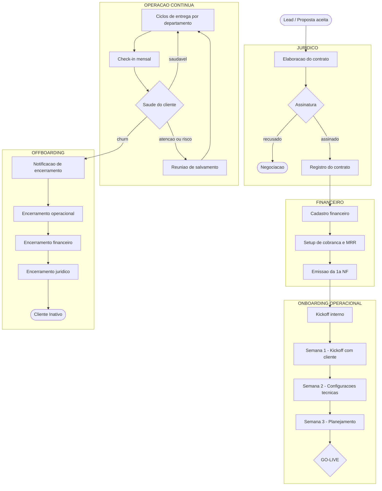

# Planejamento de Reestruturação — Fibbo

**Projeto:** Consultoria Fibbo — Fase 2 (Planejamento e Execução)
**Data:** 09/07/2026
**Autora:** Paolla Fonseca Consultoria
**Referência:** [AS IS — Estrutura e Operação do ClickUp Fibbo](./as-is/as-is-clickup-fibbo.md)

---

## 1. Objetivo

Reestruturar o ClickUp da Fibbo para que ele reflita e sustente o ciclo de vida completo do cliente — da assinatura do contrato ao offboarding — com visibilidade consolidada, capacity planning real e automações que eliminem trabalho manual repetitivo.

O resultado esperado é um workspace onde Fabricio e as lideranças consigam responder em segundos: *"Qual cliente está em que fase? Quem está alocado em quê? Tenho capacidade para fechar um novo contrato?"*

---

## 2. Premissas de Projeto

1. **Fluxo contínuo e completo.** O cliente não pode "sumir" entre áreas. Do jurídico ao offboarding, cada etapa precisa ter um responsável, um status e uma data no ClickUp.
2. **Cliente como eixo primário.** Toda tarefa de produção precisa ter a dimensão cliente explícita — não no nome da tarefa, mas num campo ou relação.
3. **Um único lugar para cada coisa.** Cada tipo de trabalho vive em um único lugar; sem duplicatas de suporte, sem folders replicados.
4. **Dados antes de dashboards.** Disciplina de preenchimento vem antes de dashboards bonitos. O TO BE define rituais de dado, não só estrutura.
5. **Não parar a operação.** A reestruturação será faseada. O que está funcionando (Linha Editorial, Sites em produção) continua rodando enquanto o novo modelo é construído ao lado.
6. **Stack de relatórios em transição.** O Stract foi cancelado. Decisões de automação de performance devem assumir a nova stack (Meta API + Google Ads API), não a anterior.

---

## 3. Ciclo de Vida Completo do Cliente

O fluxo abaixo define **todas as fases que um cliente percorre na Fibbo**, do primeiro contato ao encerramento. Cada fase precisa ter dono, status e tarefas rastreadas no ClickUp.



### 3.1 Fases e donos

| Fase | Dono atual (provável) | Dono TO BE (a confirmar) | Rastreado no ClickUp hoje? |
|---|---|---|---|
| Jurídico / Contrato | Fabricio | A definir | ❌ Não |
| Cadastro financeiro | Fabricio / Mariana | A definir | ❌ Não |
| Setup de cobrança / MRR | Fabricio | A definir | ❌ Parcialmente (campo MRR existe, sem processo) |
| Onboarding operacional | Mariana | Gerente de Projetos | ⚠️ Template existe, mas possivelmente não usado |
| Operação contínua | Por departamento | Por departamento | ✅ Parcialmente (DEPARTAMENTOS) |
| Check-in / CS | Mariana / Fabricio | CS Manager | ⚠️ Campo "Próximo Checkin" existe, lista vazia |
| Offboarding | Fabricio | A definir | ⚠️ Space existe, pouco rastreado |

---

## 4. Roteiro de Entrevistas

Antes de redesenhar qualquer estrutura no ClickUp, precisamos fechar as lacunas de processo com as áreas. As entrevistas abaixo têm esse objetivo.

### 4.1 Entrevista — Jurídico / Contratos
**Com quem:** Fabricio (e eventual responsável jurídico externo, se houver)
**Duração estimada:** 45 min

**Perguntas obrigatórias:**
1. Qual ferramenta gerencia os contratos hoje? (Assiny? DocuSign? Pasta no Drive?)
2. Quais tipos de contrato existem? (Recorrente mensal, projeto pontual, misto?)
3. Quais escopos existem? Há um "cardápio" de planos ou é sempre customizado?
4. Quem aprova o contrato antes de ir para o cliente?
5. O que acontece quando o contrato é assinado? Quem é notificado?
6. Como a Fibbo registra o início oficial do contrato (data de assinatura vs. data de início do serviço)?
7. Existem aditivos contratuais? Como são controlados?
8. Como funciona o processo de distrato? Tem prazo mínimo de aviso? Quem executa?
9. Quais informações do contrato o financeiro e a operação precisam receber no momento da assinatura?

**Saída esperada:** lista de tipos de contrato + escopo padrão por tipo + fluxo jurídico mapeado + campos que precisam existir na ficha do cliente no ClickUp.

---

### 4.2 Entrevista — Financeiro / Faturamento
**Com quem:** Fabricio + responsável financeiro (se houver pessoa separada)
**Duração estimada:** 45 min

**Perguntas obrigatórias:**
1. Quais sistemas financeiros a Fibbo usa hoje? (Conta azul? Omie? Planilha? Nenhum?)
2. Como o cliente é cadastrado financeiramente quando o contrato é assinado?
3. Quais dados financeiros são necessários para cadastro? (CNPJ, dados bancários, contato financeiro?)
4. Como funciona o ciclo de cobrança? (Boleto, PIX, cartão? Dia fixo de vencimento?)
5. O MRR varia por cliente ou é fixo pelo plano?
6. Existe cobrança separada de budget de mídia? Quem controla o saldo?
7. Quem emite a NF? Quando (antes ou depois do pagamento)?
8. Como é feita a inadimplência? Tem régua de cobrança?
9. O encerramento de contrato tem processo de última cobrança e crédito?
10. Quais relatórios financeiros o Fabricio precisa ver? (MRR por cliente, inadimplência, previsão?)

**Saída esperada:** fluxo financeiro mapeado + dados que precisam existir na ficha do cliente + indicadores financeiros para o dashboard.

---

### 4.3 Entrevista — Operação com Fabricio
**Com quem:** Fabricio
**Duração estimada:** 45 min
**Objetivo:** entender o portfólio atual, os escopos que a Fibbo vende e como a operação é percebida pelo dono do negócio — base para o catálogo de escopos e o capacity planning.

**Perguntas obrigatórias — visão geral e comercial:**
1. Quais são os serviços / planos que a Fibbo oferece hoje? Existe um "cardápio" fechado ou cada contrato é montado do zero?
2. Quais escopos estão ativos no portfólio atual? (listar cliente a cliente se necessário)
3. Para cada serviço, qual é a estimativa real de horas por área por mês? Isso já foi calculado alguma vez?
4. Existe algum serviço onde o time gasta muito mais horas do que o contrato prevê?
5. Como o Fabricio sabe hoje se a Fibbo tem capacidade para fechar um novo contrato?
6. Existe algum cliente que "pesa mais" do que deveria para o tamanho do contrato? Por quê?
7. Há planos de ampliar o time? O que trava essa decisão hoje?
8. Quais áreas você sente que estão sobrecarregadas agora? E quais têm folga?

**Saída esperada:** lista de escopos/planos com estimativa de horas por área + visão do Fabricio sobre gargalos atuais de capacity.

---

### 4.4 Entrevista — Operação com Mariana e líderes de área
**Com quem:** Mariana Velten (gestão geral) + líderes por área
**Duração estimada:** 60 min (geral) + 30 min por área se necessário

**Perguntas gerais de operação:**
1. Quando um cliente novo chega na operação (após contrato + cadastro financeiro), qual é o primeiro passo?
2. O template de onboarding de 4 semanas está sendo usado de verdade? O que falta nele?
3. Como o cliente sabe o que vai receber e quando? Existe um cronograma compartilhado com o cliente?
4. Como as demandas do cliente chegam para a equipe hoje? (WhatsApp, email, ClickUp, reunião?)
5. Qual é o processo de aprovação de entrega? Quem aprova internamente antes do cliente?
6. Como a equipe sabe o que priorizar quando tem muito trabalho ao mesmo tempo?
7. Existe algum SLA definido? (prazo para responder ticket, prazo para entregar pauta?)
8. O que faz um cliente ser classificado como "Risco" ou "Atenção"? Quem define isso?
9. Como funciona o check-in mensal? Tem pauta fixa? Alguém registra o que foi alinhado?

**Perguntas de capacity por área** *(obrigatórias — base para o catálogo de escopos e o capacity planning):*
10. Quantas horas reais por dia cada pessoa dedica a entregas para clientes (descontando reuniões, admin e gestão)?
11. Para cada serviço ativo, quantas horas por mês essa área efetivamente gasta para entregar? (perguntar área por área)
12. Existe algum escopo que sempre estoura o tempo previsto? O que causa isso?
13. Os escopos são iguais para todos os clientes ou variam por porte/volume de entregas?
14. Quando entra um novo cliente, como o time sabe se tem espaço para absorver sem prejudicar os demais?

**Perguntas específicas por departamento:**

| Área | Perguntas adicionais |
|---|---|
| **Social Media / Linha Editorial** | Quantos posts/mês por cliente em média? Quantas horas isso consome de conteúdo e de design separadamente? Qual o prazo de aprovação de pauta? O que acontece quando o cliente não aprova no prazo? |
| **Performance / Mídia Paga** | Quantas horas/mês por conta de mídia em média? Qual o processo de relatório mensal? Quem alimenta os dados? Com o Stract cancelado, qual é o plano? |
| **SEO** | Qual é o ciclo de entrega? (produção de conteúdo, auditoria, link building — prazos e horas por entrega?) |
| **Email Marketing** | Quais clientes têm email ativo? Quantas horas por disparo? O Mautic é usado por todos ou só LeCard? |
| **Sites / LPs** | Quantas horas em média um site consome do início ao fim? E uma LP? Como o cliente solicita ajuste em site já entregue? |
| **Design** | Como chegam as demandas? Quem prioriza entre Linha Editorial e sites? Quantas horas/mês por cliente em média? |
| **Atendimento / CS** | Quem é o ponto de contato do cliente no dia a dia? Existe distinção entre CS e Gerente de Projetos? Quantos clientes por CS é o teto de qualidade? |

**Saída esperada:** lista de tipos de entrega por área + horas reais por entrega + SLAs esperados + fluxo de aprovação + rituais de gestão existentes + dados para preencher o Catálogo de Escopos (seção 5.3).

---

### 4.5 Entrevista — Offboarding
**Com quem:** Fabricio + Mariana
**Duração estimada:** 30 min

**Perguntas:**
1. Como começa um processo de offboarding? (o cliente avisa? Tem prazo mínimo de aviso?)
2. Existe um checklist do que precisa ser entregue quando um cliente encerra?
3. Quem executa cada parte (devolução de acessos, arquivos, última entrega operacional)?
4. Como funciona a parte financeira do encerramento? (acerto proporcional? última NF?)
5. Existe um processo jurídico de distrato ou basta o email/aviso?
6. O cliente "cancelado" vs. "pausado" vs. "retido" — qual é a diferença operacional de cada um?
7. Existe algum processo de tentativa de retenção antes de confirmar o encerramento?

**Saída esperada:** checklist de offboarding por tipo (cancelado, pausado, retido) + responsáveis por etapa + o que vai para o space OFFBOARDING no ClickUp.

---

## 5. Capacity Planning

### 5.1 A pergunta que precisa ser respondida

> *"Para o escopo X do cliente X, quantas horas previstas tenho comprometidas? Tenho espaço para absorver um novo contrato — e em qual área?"*

O cálculo tem duas faces que precisam ser construídas separadamente e depois cruzadas:

| Face | O que é | Pergunta que responde |
|---|---|---|
| **Supply — Capacity Real** | Quanto tempo o time tem disponível, por área | "Quantas horas a área de SEO pode entregar este mês?" |
| **Demand — Escopos Ativos** | Quanto os contratos vigentes consomem, por área | "Quanto o portfólio atual já consome da área de SEO?" |
| **Saldo** | Supply menos Demand | "Ainda tenho espaço para mais um cliente de SEO?" |

---

### 5.2 Face 1 — Capacity Real (Supply)

#### O que é capacity real

Capacity real não é o horário contratado — é o tempo efetivamente disponível para entregar para clientes, depois de descontar o overhead operacional (reuniões internas, alinhamentos, admin, gestão).

```
Capacity Bruta = horas/dia × dias úteis/mês
Overhead estimado = reuniões + admin + gestão (~20-30% da bruta)
Capacity Líquida = Capacity Bruta - Overhead
Capacity por Cliente = Capacity Líquida (distribuída entre os clientes ativos)
```

**Exemplo:**
- Camilly: 6h/dia × 22 dias = 132h brutas/mês
- Overhead estimado: 25% = 33h (reuniões, alinhamentos, revisões)
- **Capacity líquida: 99h/mês disponíveis para entrega**

#### Dimensões de capacity a mapear

A capacity precisa ser mapeada em **dois níveis**: por área e por pessoa dentro da área. Isso porque uma área pode ter capacity total, mas concentrada numa só pessoa — o que cria gargalo mesmo com "espaço" no papel.

| Área | Pessoas | Perguntas a responder nas entrevistas |
|---|---|---|
| **Operação Total** | Todos | Qual é o total de horas de entrega disponíveis no mês? |
| **Social Media / Conteúdo** | Camilly, (outros?) | Quantos clientes uma pessoa de conteúdo consegue atender? |
| **Design** | Samela, Laís, Rackel | Existe separação entre design editorial e design de site? Quem faz o quê? |
| **SEO** | A definir | Quantas horas de SEO entregamos por cliente por mês em média? |
| **Performance / Mídia Paga** | A definir | Quem opera as contas? Qual o teto de contas por gestor? |
| **Email Marketing** | A definir | Separado de Social ou é a mesma pessoa? |
| **Desenvolvimento / Sites** | Lucas, Danilo | Quantos projetos de site em paralelo é o teto? |
| **Sistemas / Automações** | Phelipe, Mateus | Capacidade disponível para projetos vs. manutenção? |
| **CS / Atendimento** | Mariana, (outros?) | Quantos clientes por CS é o teto de qualidade? |

#### Lista no ClickUp: `Capacity do Time`

**Onde:** `GESTÃO FIBBO` > `Capacity` > Lista `Capacity do Time`
**Uma tarefa = uma pessoa**

| Campo | Tipo | Exemplo |
|---|---|---|
| `Pessoa` | Assignee | Camilly Ferrugine |
| `Área` | Dropdown | Social Media / Design / SEO / Performance / Email / Dev / Sistemas / CS |
| `Horas/Dia` | Número | 6 |
| `Dias Uteis/Mes` | Número | 22 |
| `Capacity Bruta (h/mes)` | Fórmula | `Horas/Dia × Dias Uteis/Mes` |
| `Overhead (%)` | Número | 25 |
| `Capacity Liquida (h/mes)` | Fórmula | `Capacity Bruta × (1 - Overhead/100)` |
| `Afastamento no Mes` | Checkbox | Para excluir do cálculo quando aplicável |

---

### 5.3 Face 2 — Escopos Ativos (Demand)

#### O que são escopos

Cada contrato tem um ou mais **serviços contratados**. Cada serviço tem uma estimativa padrão de horas mensais necessárias para entregá-lo com qualidade. Esse "peso" do escopo é o que consome a capacity do time.

A lógica:
```
Contrato do Cliente X
  └── Serviço: Social Media Completo  →  estimativa: 30h/mês (conteúdo) + 8h/mês (design)
  └── Serviço: SEO Básico             →  estimativa: 10h/mês
  └── Serviço: Relatório Mensal       →  estimativa: 4h/mês
  
Total consumido por esse cliente:  42h/mês (sendo 30h em conteúdo, 8h em design, 10h em SEO, 4h em gestão)
```

#### Catálogo de Escopos (a construir nas entrevistas)

Antes de montar o capacity planning, precisamos criar o **catálogo de escopos** — a tabela que diz quanto cada tipo de serviço consome de cada área. Esse catálogo não existe hoje no ClickUp.

**Perguntas para definir o catálogo (entrevistas de operação):**
1. Quais são os planos/serviços que a Fibbo oferece hoje?
2. Para cada serviço, qual é a estimativa real de horas por área por mês?
3. Essa estimativa é a mesma para todos os clientes ou varia por porte/volume?
4. Existe algum serviço onde o tempo real está muito acima do estimado?

**Exemplo de catálogo (a validar com a equipe):**

| Serviço / Escopo | Conteúdo (h) | Design (h) | SEO (h) | Performance (h) | CS/Gestão (h) | Total (h/mes) |
|---|---|---|---|---|---|---|
| Social Media Essencial | 15 | 6 | 0 | 0 | 3 | 24 |
| Social Media Completo | 30 | 10 | 0 | 0 | 4 | 44 |
| SEO Basico | 0 | 0 | 10 | 0 | 2 | 12 |
| SEO Completo | 8 | 2 | 20 | 0 | 3 | 33 |
| Performance / Midia Paga | 0 | 4 | 0 | 15 | 3 | 22 |
| Email Marketing | 6 | 3 | 0 | 0 | 2 | 11 |
| Relatorio Mensal | 0 | 1 | 0 | 3 | 2 | 6 |
| Site (projeto) | 0 | 20 | 4 | 0 | 5 | 29 |

*Valores ilustrativos — precisam ser validados com cada área nas entrevistas.*

#### Lista no ClickUp: `Catalogo de Escopos`

**Onde:** `GESTÃO FIBBO` > `Capacity` > Lista `Catalogo de Escopos`
**Uma tarefa = um tipo de serviço**

| Campo | Tipo | Descrição |
|---|---|---|
| `Nome do Escopo` | Texto | "Social Media Completo" |
| `H/mes - Conteudo` | Número | Horas que este escopo consome de conteúdo |
| `H/mes - Design` | Número | Horas que consome de design |
| `H/mes - SEO` | Número | Horas que consome de SEO |
| `H/mes - Performance` | Número | Horas que consome de mídia paga |
| `H/mes - Dev` | Número | Horas que consome de desenvolvimento |
| `H/mes - CS Gestao` | Número | Horas de CS/gestão de conta |
| `Total H/mes` | Fórmula | Soma de todas as áreas |

#### Lista no ClickUp: `Alocacao de Contratos`

**Onde:** `GESTÃO FIBBO` > `Capacity` > Lista `Alocacao de Contratos`
**Uma tarefa = um serviço ativo de um cliente**

| Campo | Tipo | Exemplo |
|---|---|---|
| `Nome` | Texto | "Thalassa — Social Media Completo" |
| `Cliente` | Dropdown | Thalassa |
| `Escopo` | Relação | Social Media Completo (do Catálogo) |
| `Assignee Principal` | Pessoa | Camilly (responsável pela entrega) |
| `H/mes Contratadas` | Número | Horas do contrato (pode diferir do padrão) |
| `H/mes Estimadas` | Número | Puxa do catálogo (referência) |
| `Variacao (%)` | Fórmula | `(Contratadas - Estimadas) / Estimadas × 100` |
| `Status` | Dropdown | Ativo / Pausado / Encerrado |
| `Inicio` | Data | Data de início do contrato |

---

### 5.4 O Cruzamento: Supply vs. Demand

Com as três listas preenchidas, o cruzamento é feito por **área**:

```
Saldo por Área = Capacity Líquida da Área - Soma das H/mês de todos os contratos ativos nessa área
```

**Exemplo com dados fictícios:**

| Área | Capacity Liquida (h/mes) | Consumo dos Contratos (h/mes) | Saldo | Ocupacao (%) |
|---|---|---|---|---|
| Conteúdo / Social | 99h (Camilly) | 87h (6 clientes × ~14h) | +12h | 88% |
| Design | 60h (Samela + Laís) | 55h | +5h | 92% |
| SEO | 40h | 30h | +10h | 75% |
| Performance | 50h | 48h | +2h | 96% |
| Dev / Sites | 80h (Lucas + Danilo) | 35h | +45h | 44% |

**Leitura:** Performance está a 96% — a Fibbo não pode fechar um novo contrato com Performance sem antes ampliar o time ou revisar escopos existentes. Dev tem folga.

#### Dashboard de Capacity

| Widget | O que mostra |
|---|---|
| Barras de ocupação por área | % da capacity consumida — vermelho acima de 85% |
| Saldo disponível por área (h/mes) | Horas livres para absorver novos contratos |
| Heatmap pessoa × cliente | Quem está em quais clientes e quanto |
| Simulador de novo escopo | Seleciona um escopo do catálogo e mostra o impacto por área |
| Alerta de sobrecarga | Áreas acima de 90% — visível para Fabricio antes de fechar venda |

---

### 5.5 Regras de uso

1. **Antes de fechar qualquer novo contrato**, verificar o saldo de capacity por área no dashboard
2. O **Catálogo de Escopos** é o contrato interno do que cada serviço custa — precisa de dono e revisão trimestral
3. Quando um escopo muda (aditivo, redução), a linha em `Alocacao de Contratos` é atualizada no mesmo dia
4. Quando um cliente encerra, a linha é marcada como "Encerrado" — o saldo volta automaticamente ao cálculo
5. A capacity líquida de cada pessoa é revisada mensalmente (afastamentos, mudanças de carga)

---

### 5.6 O que precisamos levantar nas entrevistas para montar isso

| Dado necessário | Quem sabe | Onde buscar |
|---|---|---|
| Horas reais disponíveis por pessoa | Cada pessoa + Mariana | Entrevista operação |
| Overhead real (reuniões, admin) | Mariana + líderes de área | Entrevista operação |
| Lista de escopos/planos que a Fibbo vende | Fabricio | Entrevista jurídica/comercial |
| Horas reais que cada escopo consome por área | Líderes de área | Entrevista por área |
| Quais clientes têm quais escopos hoje | Fabricio + Mariana | Contratos ativos |
| Se existe algum cliente consumindo muito mais do que o contratado | Líderes de área | Entrevista operação |

---

## 6. Mapeamento de Automações por Etapa

### 6.1 Automações nativas do ClickUp (sem código)

| Gatilho | Ação | Etapa do fluxo |
|---|---|---|
| Tarefa criada em "Onboarding Ativo" | Notifica Mariana + Gerente de Projetos | Início do onboarding |
| Status muda para "GO-LIVE" | Preenche campo "Data de Go-Live" com data atual | Go-live do cliente |
| Campo "Fase" muda para "Ativo" | Move tarefa do cliente para lista "Clientes Ativos" | Pós-onboarding |
| Data "Vencimento do Contrato" está a 30 dias | Cria tarefa de "Renovação" e notifica Fabricio | Renovação |
| Status muda para "Churn" | Cria lista de offboarding a partir do template | Início do offboarding |
| Tarefa de Ticket criada | Notifica assignee do cliente (CS Manager) | Suporte |
| Tarefa de Ticket fechada | Envia email de confirmação ao solicitante (via integração) | Suporte |
| Última tarefa do template de onboarding concluída | Notifica que onboarding foi concluído + muda "Fase" para "Ativo" | Fim do onboarding |

### 6.2 Automações externas (Make / n8n)

| Gatilho | Ação | Ferramenta |
|---|---|---|
| Contrato assinado na ferramenta jurídica | Cria ficha do cliente no ClickUp + instancia template de onboarding | Make |
| Cliente cadastrado no financeiro | Preenche campos MRR, plano e data de início na ficha ClickUp | Make |
| Pagamento confirmado | Muda status financeiro na ficha do cliente | Make / financeiro |
| Formulário de suporte preenchido | Cria tarefa na lista de Tickets de Suporte com campos preenchidos | Make (já existe o form) |
| Fim do mês | Cria tarefas de relatório mensal para cada cliente ativo | Make |
| Relatório de saldo de ads acima do limite | Notifica Gestor de Tráfego + Fabricio via WhatsApp/Slack | Make + Meta/Google API |

### 6.3 O que NÃO automatizar ainda

- Relatórios de performance (aguardar estabilização da nova stack Meta/Google API)
- Qualquer coisa que dependa de aprovação humana com julgamento (ex.: classificação de saúde do cliente)
- Processos que ainda não têm processo definido (não dá para automatizar o caos)

---

## 7. Dashboards a Criar

### 7.1 Dashboard Executivo (Fabricio)

**Objetivo:** visão rápida do portfólio e saúde do negócio

| Widget | Dado |
|---|---|
| Cartões de KPI | Total de clientes ativos / MRR total / Novos contratos (mês) / Churns (mês) |
| Status do portfólio | Quantos clientes em cada fase (Onboarding / Ativo / Risco / Atenção / Pausa) |
| Capacity do time | Barra por pessoa — quem está sobrecarregado |
| Contratos próximos do vencimento | Lista com data e responsável |
| Tickets em aberto | Contagem e prazo médio de resolução |

### 7.2 Dashboard Operacional (Mariana / Lideranças de área)

**Objetivo:** acompanhar entregas e andamento dos processos

| Widget | Dado |
|---|---|
| Tarefas em atraso por área | Social / SEO / Performance / Email / Site |
| Status da Linha Editorial por cliente | Qual etapa cada cliente está (Pauta / Redação / Design / Aprovação / Publicado) |
| Check-ins do mês | Agendados vs. realizados |
| Onboardings em andamento | Clientes em onboarding e % de conclusão |
| Tickets por tipo e status | Aberto / Em Atendimento / Resolvido (por área) |

### 7.3 Dashboard de Capacity (para tomada de decisão comercial)

**Objetivo:** responder se a Fibbo tem espaço para novo contrato

| Widget | Dado |
|---|---|
| Heatmap de capacity | Cada pessoa × semana — verde (livre) / amarelo (80%) / vermelho (100%+) |
| Horas disponíveis por perfil | Quantas horas livres há em Social Media, Design, Dev, etc. |
| Simulador de novo cliente | (manual) campo para simular quanto um novo escopo consome |

---

## 8. Hipótese de Estrutura no ClickUp (TO BE)

*Hipótese de design fundamentada — será validada e refinada após as entrevistas. Não é decisão fechada, é o ponto de partida para a conversa.*

### 8.1 A decisão estrutural central

Toda reestruturação de ClickUp em agência começa pela mesma pergunta:

> **A estrutura se organiza por departamento — e o projeto do cliente percorre as áreas?**
> **Ou a estrutura se organiza por cliente — e os processos departamentais são incorporados dentro de cada cliente conforme o escopo?**

Não existe resposta universalmente certa. Existe a resposta certa para o modelo de negócio específico. Por isso é importante entender o que cada modelo implica antes de decidir.

---

### 8.2 Os dois modelos explicados

#### Modelo A — Estrutura por departamento (eixo funcional)

```
DEPARTAMENTOS
├── Social Media
│   └── Linha Editorial (todas as clientes numa lista)
├── SEO
│   └── Producao de Conteudo (todos os clientes)
├── Performance
└── ...
```

O cliente existe como uma dimensão dentro de cada área. Para saber tudo que está acontecendo com o cliente X, é preciso ir em Social Media, depois em SEO, depois em Performance — e montar o quadro mentalmente.

**Quando faz sentido:** operação altamente padronizada, grande volume de clientes homogêneos (50+), times que nunca transitam entre contas, produto tipo fábrica sem customização.

---

#### Modelo B — Estrutura por cliente (eixo de projeto)

```
CLIENTES
├── [Cliente A]
│   ├── Conta (ficha, contrato, saude)
│   ├── Onboarding
│   ├── Entregas (Social, SEO, Performance — com campo Servico)
│   └── Tickets
├── [Cliente B]
│   └── (mesma estrutura)
```

O cliente é a pasta. Os processos departamentais existem como listas e campos dentro dessa pasta — não como eixo da hierarquia. Para saber tudo que está acontecendo com o cliente X, você abre uma pasta.

**Quando faz sentido:** relacionamento próximo com o cliente, escopos variados, times que transitam entre contas, produto com customização por cliente, necessidade de visibilidade consolidada por conta.

---

### 8.3 Por que o modelo por cliente é o certo para a Fibbo

**A pergunta-chave é: qual é a unidade de valor da Fibbo?**

A unidade de valor não é o departamento de Social Media — é o resultado para o cliente Thalassa. O departamento é meio, o cliente é o fim. Quando a estrutura não reflete isso, o trabalho que mais importa (a entrega ao cliente) fica invisível na organização.

O AS IS já evidenciou esse problema: a Fibbo tem campos ricos de cliente (MRR, saúde, fase, gerente de projetos) mas a produção opera em departamentos — as duas dimensões nunca se conectam. O resultado é que não existe hoje uma visão consolidada por cliente, que é exatamente a visão que Fabricio, Mariana e o próprio cliente precisam.

A estrutura por cliente resolve isso estruturalmente, não por gambiarra de campo.

---

### 8.4 Benefícios do modelo por cliente para a Fibbo

**1. Visibilidade completa e instantânea por cliente**
Tudo que envolve o cliente X está numa pasta: onboarding, entregas em andamento, tickets abertos, histórico, campos de contrato, saúde da conta. Fabricio abre uma pasta e enxerga o cliente inteiro — sem vasculhar 12 listas de departamentos e montar o quadro mentalmente. Isso vale especialmente para reuniões de CS, check-ins e conversas comerciais sobre renovação ou expansão de escopo.

**2. Compartilhamento com o stakeholder do cliente**
O ClickUp permite dar acesso de convidado a uma pasta específica sem expor o restante do workspace. O cliente vê só o que é dele: a linha editorial do mês, o andamento do site, os tickets resolvidos, o cronograma de onboarding. Isso cria um nível de transparência que diferencia a Fibbo de agências que mandam PDF por WhatsApp ou atualizam planilhas manualmente. É um diferencial de produto, não só de organização interna.

**3. Dashboards por cliente**
Com uma pasta por cliente, é possível criar um dashboard filtrado por aquela pasta e ter: status de todas as entregas, tickets abertos, próximo check-in, saúde da conta, % de onboarding concluído — tudo referente a um único cliente. Isso é impossível quando o cliente é apenas uma tag ou campo numa lista departamental.

**4. Separação clara entre entrega e gestão**
Dentro da pasta, listas com propósitos distintos coexistem sem se misturar:
- `Conta` → ficha do cliente, campos de contrato, MRR, fase do ciclo — gestão de conta pura
- `Entregas` → tarefas de produção com due date, assignee e campo de serviço — operação
- `Tickets` → suporte e solicitações ad-hoc
- `Onboarding` → checklist com progresso visível

Hoje no AS IS, tarefa de gestão e tarefa de entrega vivem misturadas na mesma lista. O modelo por cliente resolve isso naturalmente pela separação de listas com propósitos claros.

**5. Histórico preservado e offboarding limpo**
Quando o cliente encerra, arquiva-se a pasta inteira. Todo o histórico — entregas, tickets, trocas, campos — fica preservado num único lugar, acessível quando necessário. Nada precisa ser deletado, movido ou reorganizado. Nos modelos departamentais, o histórico de um cliente encerrado está espalhado em dezenas de listas de áreas diferentes e é praticamente irrecuperável.

**6. Templates instanciados por cliente**
O template de onboarding (que hoje possivelmente não está sendo usado, conforme o AS IS) passa a ser instanciado dentro da pasta do cliente no momento certo do fluxo — com contexto, com assignees corretos para aquele escopo, e com visibilidade para quem precisa acompanhar. Templates funcionam quando têm um "lar" claro; sem pasta por cliente, o template fica genérico e desconectado.

---

### 8.5 Riscos e como mitigá-los

#### Risco 1 — Área operacional perde visão do próprio backlog

**O problema:** se cada cliente tem sua própria lista de entregas, a Camilly precisaria abrir 15 pastas para saber o que fazer hoje em Social Media.

**A solução:** views e dashboards transversais, não mudança de estrutura.
- Uma view "Social Media — todos os clientes" filtra tarefas com `Serviço = Social Media` em todo o workspace, mostrando tudo junto ordenado por data e assignee
- O dashboard de área mostra workload por pessoa cruzando todos os clientes
- O campo `Serviço` em cada tarefa de entrega é o que habilita essa pivotagem

A Camilly abre a view de Social Media e vê sua fila completa. O Fabricio abre a pasta do cliente e vê tudo daquele cliente. São duas lentes sobre os mesmos dados — sem duplicar estrutura.

#### Risco 2 — Proliferação de pastas e perda de padrão

**O problema:** com 20 clientes, cada pasta pode virar um mundo próprio se não houver disciplina. Uma pessoa cria listas extras, outra muda os nomes, o padrão se perde.

**A solução:** template de pasta rigoroso e governança de criação.
- O template define exatamente quais listas existem em toda pasta de cliente (Conta, Onboarding, Entregas, Tickets, Offboarding) — ninguém cria listas fora do padrão sem aprovação
- A criação de nova pasta de cliente segue um ritual: é parte do fluxo de onboarding, não uma ação avulsa
- Uma automação (Make) pode instanciar a pasta a partir do template quando o contrato é assinado

#### Risco 3 — Dificuldade de visão consolidada de portfólio

**O problema:** com os dados espalhados em N pastas de cliente, como ter uma visão de "todos os clientes ativos com suas fases e saúde"?

**A solução:** a lista `Conta` dentro de cada pasta alimenta campos padronizados (Fase, Saúde, MRR, Vencimento). Um dashboard de portfólio agrega esses campos de todas as pastas via filtro por campo — sem precisar abrir cada pasta individualmente.

---

### 8.6 Quando o modelo departamental faria sentido (e por que não é o caso da Fibbo)

| Critério | Modelo departamental | Modelo por cliente | Fibbo |
|---|---|---|---|
| Volume de clientes | 50+ | Até ~30-40 | ~20 clientes |
| Customização por cliente | Baixa — produto igual para todos | Alta — escopos variados | Alta — escopos variados |
| Relacionamento com cliente | Baixo — cliente não acessa a ferramenta | Alto — cliente pode acompanhar | Alto — desejado |
| Times por conta | Especialistas isolados por área | Times transitam entre contas | Times transitam |
| Perguntas frequentes da liderança | "O que a área de SEO está fazendo?" | "O que está acontecendo com o cliente X?" | Segunda opção |

A Fibbo não tem volume alto o suficiente para justificar o modelo departamental, tem escopos variados, quer relacionamento próximo e já sofre com a falta de visão por cliente — os quatro sinais de que o modelo por cliente é o correto.

---

### 8.7 Hipótese de hierarquia

```
Workspace Fibbo
│
├── CLIENTES (space)
│   ├── Folder: Pipeline e Juridico
│   │   └── Lista: Contratos em Negociacao / Assinatura
│   │
│   ├── Folder: [CLIENTE A]  ← uma pasta por cliente ativo
│   │   ├── Lista: Conta      (ficha + campos de contrato, MRR, fase, saude)
│   │   ├── Lista: Onboarding (instancia do template — 4 semanas)
│   │   ├── Lista: Entregas   (tarefas de producao com campo Servico e due date)
│   │   ├── Lista: Tickets    (suporte e solicitacoes deste cliente)
│   │   └── Lista: Offboarding (ativada quando necessario)
│   │
│   ├── Folder: [CLIENTE B]
│   │   └── (mesma estrutura)
│   │
│   └── Folder: Inativos
│       └── (pastas de clientes encerrados — arquivadas)
│
├── OPERACAO INTERNA (space)
│   ├── Folder: Suporte Unico
│   │   └── Lista: Fila de Tickets  (consolida tickets de todos os clientes)
│   ├── Folder: Sites e LPs em Andamento
│   │   └── (projetos de site — cada um como lista ou folder proprio)
│   └── Folder: Demandas Internas
│       └── (tarefas que nao sao de cliente — operacao interna da Fibbo)
│
└── GESTAO FIBBO (space)
    ├── Folder: Capacity
    │   ├── Lista: Capacity do Time
    │   ├── Lista: Catalogo de Escopos
    │   └── Lista: Alocacao de Contratos
    ├── Folder: Financeiro
    │   └── Lista: Faturamento Recorrente
    └── Folder: Templates
        └── (central unica — onboarding, cliente ativo, offboarding, servicos)
```

---

### 8.8 Como os departamentos sobrevivem nesse modelo

Os departamentos não desaparecem — eles passam a ser uma **dimensão de filtro**, não um eixo de estrutura.

| O que hoje é... | Vira... |
|---|---|
| Folder "Redes Sociais" com lista "Linha Editorial" | Campo `Servico = Social Media` nas tarefas de entrega dentro de cada pasta de cliente |
| Folder "SEO" com 3 listas | Campo `Servico = SEO` nas tarefas de entrega + view transversal "SEO — todos os clientes" |
| Folder "Operação Fibbo" (replica departamentos) | Eliminado — era estrutura compensando ausência de processo |
| Space "SITES & LANDING PAGES" | Projetos de site viram listas dentro da pasta do cliente + folder "Sites em Andamento" para visão consolidada |
| Space "OFFBOARDING" | Lista de Offboarding dentro de cada pasta de cliente, ativada quando necessário |

A view de cada área fica num **dashboard de operação** que filtra tarefas por `Servico` em todo o workspace — a Camilly vê toda a fila de Social Media, a área de SEO vê toda a fila de SEO, sem precisar abrir pasta por pasta.

---

### 8.9 O que as entrevistas precisam confirmar antes de fechar esse modelo

- Quantos clientes ativos existem hoje? (define se uma pasta por cliente é gerenciável)
- Algum cliente tem estrutura muito diferente dos outros? (define se o template de pasta precisa variações)
- O Fabricio quer mesmo compartilhar acesso do ClickUp com clientes? (define o nível de organização dentro da pasta)
- Existe trabalho interno (da própria Fibbo como cliente) que precisa de espaço separado?

---

## 9. Plano de Execução (Fases)

### Fase 0 — Entrevistas e alinhamento (semanas 1–2)
- [ ] Entrevista jurídica com Fabricio
- [ ] Entrevista financeira com Fabricio
- [ ] Entrevista operacional com Mariana
- [ ] Entrevistas por área (Social, Performance, SEO, Sites, Suporte)
- [ ] Entrevista de offboarding
- [ ] Validação do esboço de estrutura com Fabricio e Mariana
- [ ] Validação do modelo de capacity com Fabricio

### Fase 1 — Fundação (semanas 3–4)
- [ ] Criar space `GESTÃO FIBBO` com estrutura de Capacity
- [ ] Preencher lista `Capacity do Time` com todos os membros e suas capacidades
- [ ] Preencher lista `Alocação de Time` com os clientes ativos e horas do escopo
- [ ] Padronizar statuses — definir esquema único em PT-BR por tipo de trabalho
- [ ] Criar central única de templates (consolidar os 4 locais atuais)
- [ ] Ativar e configurar o template de onboarding para uso real

### Fase 2 — Migração da ficha de clientes (semanas 5–6)
- [ ] Criar folder por cliente ativo (começar pelos 5 mais críticos)
- [ ] Migrar dados de "Clientes Ativos" para as fichas individuais
- [ ] Preencher campos obrigatórios: MRR, fase, go-live, gerente de projetos
- [ ] Separar "registro de contrato" de "backlog de tarefas" (resolver A4 do AS IS)

### Fase 3 — Operação e tickets (semanas 7–8)
- [ ] Unificar os dois sistemas de tickets em um único funil
- [ ] Adicionar campo `Cliente` como obrigatório nas tarefas de produção
- [ ] Ajustar Linha Editorial para usar campo cliente em vez de nome da tarefa
- [ ] Restaurar disciplina de datas na Linha Editorial
- [ ] Configurar view de Workload com as alocações do Capacity

### Fase 4 — Automações e dashboards (semanas 9–12)
- [ ] Configurar automações nativas do ClickUp (lista §6.1)
- [ ] Criar Dashboard Executivo
- [ ] Criar Dashboard Operacional
- [ ] Criar Dashboard de Capacity
- [ ] Mapear e implementar automações externas (Make) — começar pelas mais simples
- [ ] Aguardar estabilização da stack Meta/Google antes de automações de relatório

### Fase 5 — Estabilização e treinamento (semanas 13–16)
- [ ] Treinamento do time no novo modelo
- [ ] Definir rituais: quem preenche o quê, quando e com qual frequência
- [ ] Revisar e corrigir o que não funcionou nas primeiras semanas
- [ ] Documentar o playbook de operação no ClickUp (Docs)
- [ ] Definir cadência de revisão da estrutura (trimestral)

---

## 10. Perguntas em Aberto

Estas perguntas precisam ser respondidas nas entrevistas antes de finalizar o TO BE:

| # | Pergunta | Impacto |
|---|---|---|
| P1 | Qual ferramenta jurídica é usada para contratos? Tem API? | Define se o onboarding pode ser automatizado a partir da assinatura |
| P2 | Qual sistema financeiro a Fibbo usa? | Define onde buscar dados de MRR e faturamento para o dashboard |
| P3 | Existe um "cardápio" de escopos/planos ou é tudo customizado? | Define se dá para criar templates de capacity por tipo de plano |
| P4 | Qual é a capacity real de cada pessoa (h/dia, quantos dias/semana)? | Dado fundamental para o capacity planning |
| P5 | Quem é o CS Manager de cada cliente? (confirmação dos dados) | Necessário para o campo já existente e os dashboards |
| P6 | O onboarding de 4 semanas é o mesmo para todos os escopos ou varia? | Define quantos templates de onboarding precisam existir |
| P7 | O processo de offboarding tem prazo contratual definido? | Define o que precisa ser rastreado no space OFFBOARDING |
| P8 | Existe algum acordo de nível de serviço (SLA) informal que o time já segue? | Base para formalizar SLAs no processo de tickets |

---

*Documento em elaboração — Paolla Fonseca Consultoria*
*Próximo passo: agendar entrevistas e preencher as perguntas em aberto (§10)*
